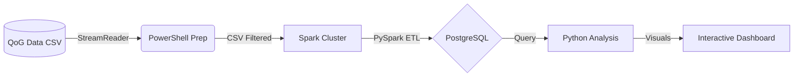

# 📡 Informe de Inteligencia: Gasto Militar y Resiliencia Democrática ante el Yihadismo


**🚀 [ACCEDER AL DASHBOARD OPERATIVO (LIVE)](https://garciaanyer2-ai.github.io/trabajo.final/)**

---

## 📑 Resumen Ejecutivo
Este informe analiza la intersección entre el esfuerzo económico en defensa y la salud de las instituciones liberales en cinco estados bajo la presión asimétrica del fenómeno yihadista global. Se utiliza procesamiento distribuido para identificar patrones de resiliencia y erosión democrática en el periodo 2000-2023.

---

## 🔍 Pregunta de Investigación (Evolución)

| Nivel | Formulación |
|:---|:---|
| **🟢 Principiante** | ¿Cómo les va con el dinero de las armas y la democracia a los países con terrorismo? |
| **🔵 Actual** | ¿Cómo ha evolucionado la relación entre el gasto militar y la calidad democrática en países clave afectados por el yihadismo (2000-2023)? |
| **🔴 Experto** | Estudio econométrico sobre la correlación entre la intensidad del gasto militar (GPD_SHARE) y el deterioro de los índices de poliarquía (V-Dem) bajo presión asimétrica yihadista. |

---

## 🌍 Teatro de Operaciones (Países Seleccionados)

- **🛡️ España (ESP)**: Referente de resiliencia democrática en el flanco sur europeo.
- **🇫🇷 Francia (FRA)**: Potencia con alta exposición y respuesta militar transnacional.
- **🇹🇷 Turquía (TUR)**: Eje estratégico Euro-Asiático en proceso de transición política.
- **🇦🇫 Afganistán (AFG)**: Análisis de colapso institucional y conflicto prolongado.
- **🇷🇺 Rusia (RUS)**: Actor clave con tendencia hacia la centralización del poder y gasto militar expansivo.

---

## 🏗️ Arquitectura del Sistema



---

## 🚀 Despliegue Táctico (Quick Start)

```bash
# 1. Levantar contenedores
docker-compose up -d

# 2. Ejecutar inteligencia (ETL)
python download_qog.py
docker exec tf_spark_master /opt/spark/bin/spark-submit --master spark://spark-master:7077 /opt/spark/trabajo_final/pipeline.py

# 3. Generar visualizaciones
python analysis.py
```

---
**Analista:** Anyerlin Ravelo  
**Unidad:** Maestría en Ciberseguridad y Operaciones  
**Fecha:** 09/02/2026
