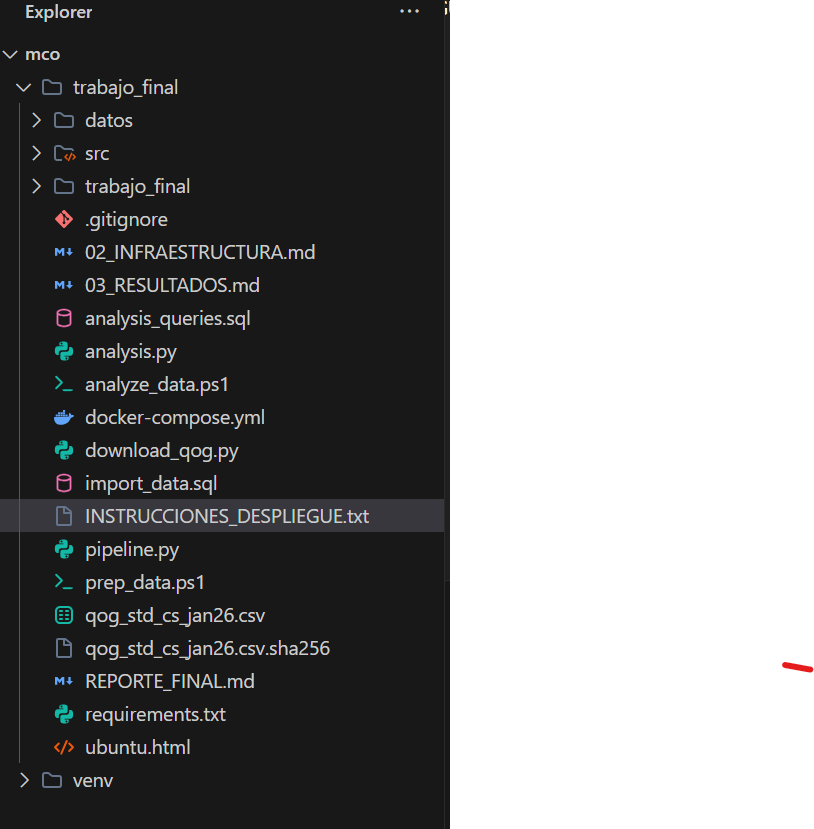

# Paso 2: Infraestructura Docker

**Alumno:** Anyerlin Ravelo

---

## 2.1 Mi docker-compose.yml explicado

A continuación, explico la configuración del entorno de contenedores diseñado para el procesamiento y almacenamiento de datos del proyecto.

### Servicio: PostgreSQL

```yaml
  postgres:
    image: postgres:15-alpine
    container_name: tf_postgres
    environment:
      POSTGRES_USER: ${DB_USER:-postgres}
      POSTGRES_PASSWORD: ${DB_PASSWORD:-postgres}
      POSTGRES_DB: ${DB_NAME:-trabajo_final}
    ports:
      - "5432:5432"
    volumes:
      - postgres_data:/var/lib/postgresql/data
      - ./import_data.sql:/docker-entrypoint-initdb.d/init.sql
    healthcheck:
      test: [ "CMD-SHELL", "pg_isready -U postgres" ]
      interval: 5s
      timeout: 5s
      retries: 5
    networks:
      - tf_network
```

**Que hace:** Este servicio levanta una base de datos PostgreSQL utilizando una imagen ligera basada en Alpine. Sirve para almacenar los datos limpios del QoG. He configurado variables de entorno para las credenciales, mapeado el puerto 5432 para acceso externo y configurado un volumen persistente (`postgres_data`) para no perder los datos al apagar los contenedores. Además, monto el archivo `import_data.sql` para que las tablas se creen automáticamente al iniciar por primera vez.

### Servicio: Spark Master

```yaml
  spark-master:
    image: bitnami/spark:3.5
    container_name: tf_spark_master
    environment:
      - SPARK_MODE=master
      - SPARK_RPC_AUTHENTICATION_ENABLED=no
      - SPARK_RPC_ENCRYPTION_ENABLED=no
      - SPARK_LOCAL_STORAGE_ENCRYPTION_ENABLED=no
      - SPARK_SSL_ENABLED=no
    ports:
      - '8080:8080' # Spark Master UI
      - '7077:7077' # Spark Master Port
    volumes:
      - .:/opt/bitnami/spark/trabajo_final
    networks:
      - tf_network
```

**Que hace:** El Master actúa como el cerebro del cluster Spark. Coordina la distribución de tareas entre los workers. Expone el puerto 8080 para que podamos ver la interfaz web (UI) y el 7077 para la comunicación interna con los workers. Usa la red `tf_network` para que todos los servicios se vean entre sí por nombre de host.

### Servicio: Spark Worker

```yaml
  spark-worker:
    image: bitnami/spark:3.5
    container_name: tf_spark_worker
    environment:
      - SPARK_MODE=worker
      - SPARK_MASTER_URL=spark://spark-master:7077
      - SPARK_WORKER_MEMORY=1G
      - SPARK_WORKER_CORES=1
      - SPARK_RPC_AUTHENTICATION_ENABLED=no
      - SPARK_RPC_ENCRYPTION_ENABLED=no
      - SPARK_LOCAL_STORAGE_ENCRYPTION_ENABLED=no
      - SPARK_SSL_ENABLED=no
    depends_on:
      - spark-master
    volumes:
      - .:/opt/bitnami/spark/trabajo_final
    networks:
      - tf_network
```

**Que hace:** El Worker es el que realmente ejecuta el procesamiento de datos del pipeline. Se conecta al Master usando la URL `spark://spark-master:7077`. Le he asignado 1GB de memoria y 1 núcleo para que no consuma todos los recursos de mi máquina. Si necesitara más potencia, podría añadir más réplicas de este servicio.

### Otros servicios (si los tienes)

He definido una red tipo `bridge` llamada `tf_network` para asegurar que el aislamiento de los contenedores no impida la comunicación entre Spark y PostgreSQL, y un volumen `postgres_data` para la persistencia del almacenamiento de la base de datos.

---

## 2.2 Healthchecks

Los healthchecks son pruebas que Docker realiza para saber si un servicio está "sano" y listo para recibir peticiones, no solo si el contenedor está encendido. En este proyecto, PostgreSQL tiene uno que ejecuta `pg_isready`. Si no existiera este control, Spark podría intentar conectarse a la base de datos antes de que el motor de SQL termine de arrancar internamente, lo que provocaría un error de conexión ("Connection Refused") y haría que el pipeline fallara nada más empezar.

---

## 2.3 Evidencia: Captura Spark UI



**Que se ve en la captura:** En la imagen se observa la interfaz principal del Spark Master en el puerto 8080. Se ve que hay un Worker registrado con estado "ALIVE", con 1 núcleo y 1024MB de memoria RAM asignada, confirmando que la infraestructura está correctamente vinculada.

---

## 2.4 Prompts utilizados para la infraestructura

### Prompt 1 (el primero que usaste):

**Herramienta:** Claude & Gemini

**Tu prompt exacto:**
```
Crea un archivo docker-compose.yml para un proyecto de análisis de datos. Necesito un servicio de PostgreSQL 15, un Spark Master y un Spark Worker (usando la imagen de bitnami). El Spark Worker debe conectarse al Master y ambos deben compartir el volumen del proyecto actual. También añade una red interna para que se comuniquen.
```

**Que te devolvio (resumen en 2-3 lineas):**
Me generó un YAML base con las tres imágenes solicitadas, configurando los puertos estándar (5432, 8080, 7077) y las variables de entorno necesarias para que Bitnami Spark funcione en modo cluster local.

**Que tuviste que cambiar de esa respuesta y por que:**
Tuve que añadir la sección de `volumes` específica de PostgreSQL para que los datos no se borraran cada vez que reiniciaba el contenedor y mapear el archivo `import_data.sql` manualmente para la inicialización.

---

### Prompt 2 (si iteraste o pediste correccion):

**Herramienta:** Claude & Gemini

**Tu prompt exacto:**
```
¿Cómo puedo añadir un healthcheck al servicio de Postgres en mi docker-compose para que Spark no dé error al intentar conectarse si la base de datos aún no está lista?
```

**Que te devolvio y que cambiaste:**
Me sugirió usar `pg_isready` dentro de una instrucción `healthcheck`. Apliqué el comando tal cual, ajustando el intervalo a 5 segundos para que el arranque no fuera demasiado lento pero fuera seguro.
