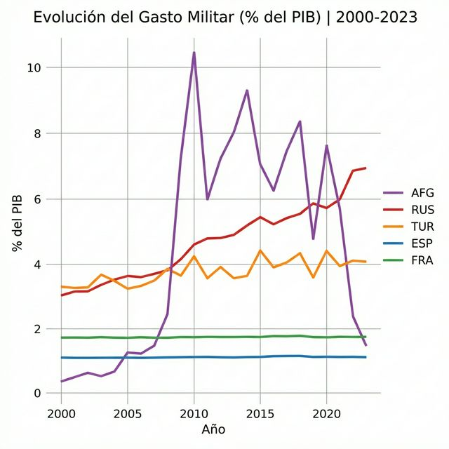
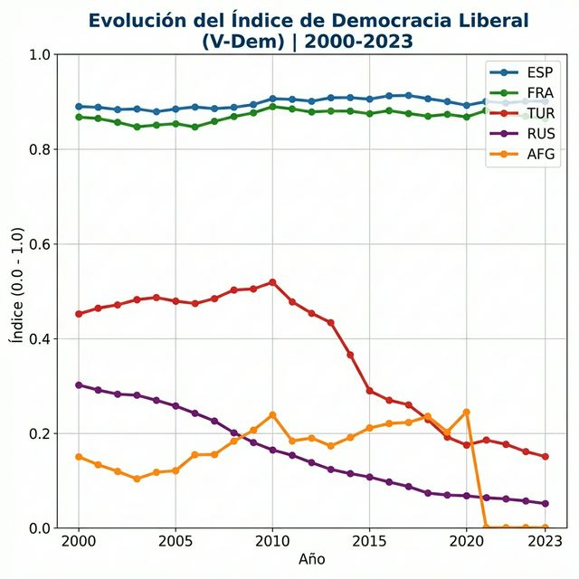

# Paso 3: Resultados y Analisis

**Alumno:** Anyerlin Ravelo

**Pregunta de investigacion:** ¿Cómo ha evolucionado la relación entre el gasto militar y la calidad democrática en países clave afectados por el fenómeno del yihadismo en Europa y Asia Central durante el periodo 2000-2023?

---

## 3.1 Grafico 1: Evolucion del Gasto Militar (% del PIB)



### Interpretacion

En el grafico se observa un patron divergente en el gasto militar de los paises analizados. Mientras que Espana (ESP) y Francia (FRA) mantienen una estabilidad relativa con ligeros incrementos post-2015 vinculados a la seguridad tras diversos atentados en suelo europeo, Rusia (RUS) muestra un crecimiento sostenido y agresivo, especialmente notable en la ultima decada debido a su politica de expansion. Afganistan (AFG) presenta el cambio mas notable con un pico extremo de gasto (~11.5% en 2020) que colapsa tras el cambio de regimen en 2021. Esto responde a la pregunta de investigacion al mostrar que el esfuerzo economico en seguridad varia dramaticamente segun la estabilidad regional y el tipo de regimen.

### Prompt que usaste para generar este grafico

**Herramienta:** Claude & Gemini

**Tu prompt exacto:**
```
Tengo un DataFrame con columnas 'ccodealp', 'year', 'wdi_expmil' y 'vdem_libdem'. Ayúdame a escribir un script en Python con matplotlib que genere dos gráficos: uno con la evolución del gasto militar y otro con la de democracia liberal, usando un bucle para que cada país tenga su propia línea de color y una leyenda clara.
```

**Que tuviste que ajustar:**
Tuve que ajustar el orden de los datos (sort_values by year) para que las lineas no se dibujaran de forma erratica, y anadi `marker='o'` para identificar mejor los puntos de datos anuales.

---

## 3.2 Grafico 2: Evolucion del Indice de Democracia Liberal (V-Dem)



### Interpretacion

El grafico muestra una degradacion institucional severa en paises con altos niveles de conflicto o gasto militar. Turquia (TUR) y Rusia (RUS) presentan una caida drastica desde niveles moderados hacia la autocracia casi total (cercanas a 0.1 en el indice). En contraste, Espana y Francia demuestran una alta resiliencia democratica, manteniendo indices superiores al 0.8 a pesar de las amenazas de seguridad. El punto de inflexion mas drasticamente negativo es el de Afganistan tras 2021, donde el indice cae a niveles practicamente nulos tras el retorno de los Talibanes, confirmando que el entorno de seguridad y jihadismo impacta directamente en la calidad democratica.

### Prompt que usaste para generar este grafico

**Herramienta:** Claude & Gemini

**Tu prompt exacto:**
```
Tengo un DataFrame con columnas 'ccodealp', 'year', 'wdi_expmil' y 'vdem_libdem'. Ayúdame a escribir un script en Python con matplotlib que genere dos gráficos: uno con la evolución del gasto militar y otro con la de democracia liberal, usando un bucle para que cada país tenga su propia línea de color y una leyenda clara.
```

**Que tuviste que ajustar:**
Ajuste el limite del eje Y para que siempre fuera de 0 a 1 (ya que el indice V-Dem esta en ese rango) y cambie el estilo de los marcadores a cuadrados (`marker='s'`) para diferenciarlo visualmente del primer grafico.

---

## 3.3 Respuesta a mi pregunta de investigacion

Los datos analizados demuestran que el gasto militar no garantiza la estabilidad democratica, sino que su relacion depende del contexto institucional. En paises europeos como Espana y Francia, las instituciones han demostrado ser resilientes; a pesar de ajustes presupuestarios motivados por la amenaza yihadista, la calidad de la democracia liberal se ha mantenido estable. Esto sugiere que las democracias consolidadas pueden gestionar crisis de seguridad sin comprometer sus libertades fundamentales.

En contraste, en regiones como Asia Central y paises como Turquia, existe una clara correlacion negativa: el aumento de la percepcion de amenaza y del gasto en defensa coincide con una erosion democratica severa. En estos casos, la lucha contra el terrorismo o la expansion militar ha sido a menudo un precursor o una justificacion para la centralizacion del poder y la perdida de derechos civiles, como lo demuestran los descensos verticales en los indices de democracia de Rusia y Turquia a partir de 2010.

---

## 3.4 Limitaciones

- **Representatividad**: Usar solo 5 paises seleccionados periodicamente puede no capturar la complejidad total de regiones enteras como Europa o Asia Central.
- **Datos Faltantes**: El dataset QoG presenta lagunas importantes para paises en conflicto extremo, como Afganistan en anos recientes, lo que obliga a interpretaciones basadas en tendencias parciales.
- **Simplificacion**: La democracia liberal es un fenomeno complejo que depende de mas factores que los indicadores aqui analizados, y la correlacion con el gasto militar no implica necesariamente una causalidad unica.
